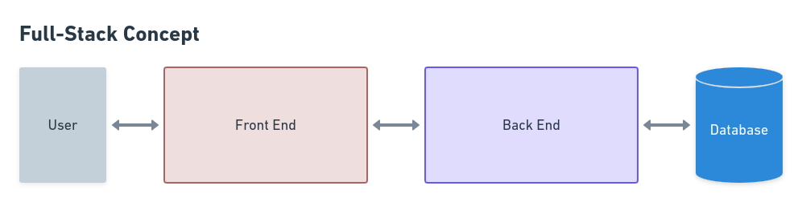
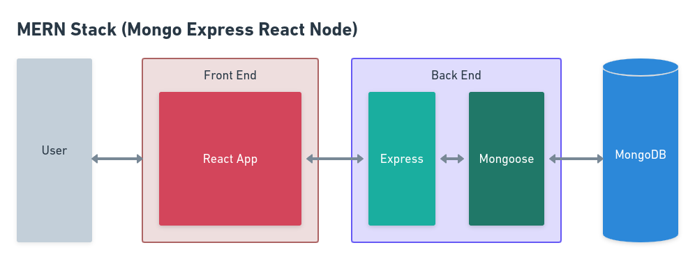
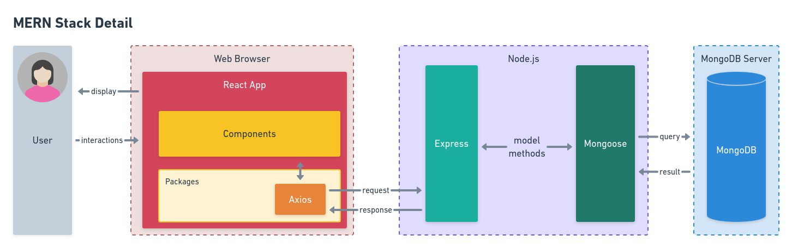
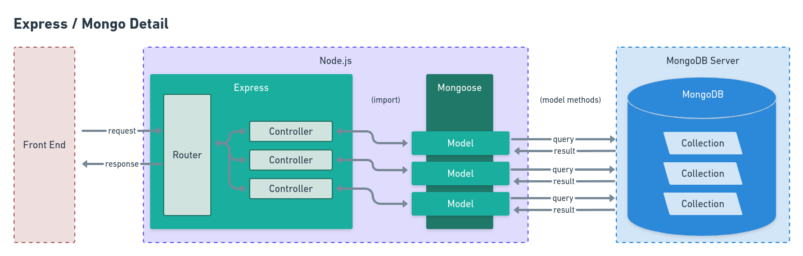
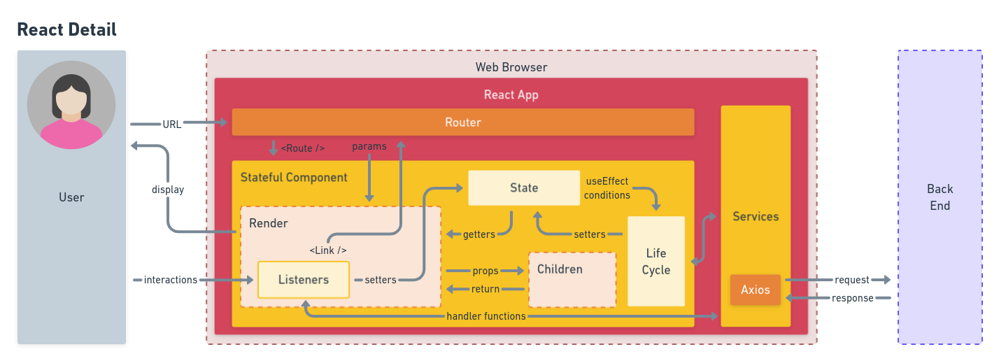
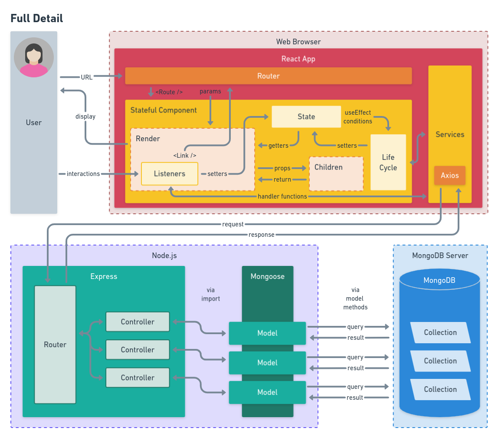

# MERN Stack Architecture

The tools we've learned for development so far -- React, Express, MongoDB and Node.js -- are often referred to as the "MERN stack." Here's how it all fits together. (NOTE: This markdown file should be viewed in GitHub's light mode.)

## The "full-stack" idea

When people refer to a "full-stack application," they typically mean something that follows this general template.

If we plug our MERN tools into this template, it looks something like this.

And with a little more specificity on how things connect, something like this.

## The Express/Mongo back end

Now that we've worked with various aspects of a back end -- routes, controllers, database models -- we can visualize our API application looking something like this:

>Take a moment to look at the connections drawn with arrows. Does this make sense to you so far? Do you understand any of these relationships differently? Compare ideas with a comrade.

## React and user interactions

Now looking back to React, we could visualize how React deals with user interactions as something like this.

>Does this jibe with your experience with React? What would you change in the diagram to make it clearer?

## The MERN stack in detail

If we draw the connection between our front and back ends via the API, the entire production might look something like this.

That's a lot of moving parts! You must be a pretty impressive engineer!!!
